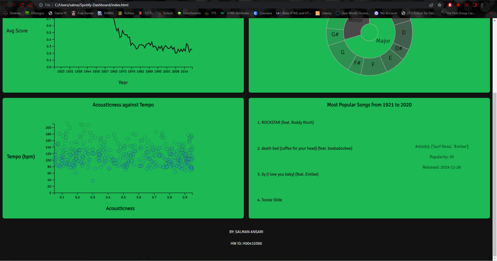

# Spotify-Dashboard

## About the Project

This project is a Spotify Dashboard created using HTML and D3.js v7. The dashboard makes use of the Spotify dataset: https://www.kaggle.com/datasets/ektanegi/spotifydata-19212020

## Screenshots

    <b>Dashboard</b>

## Installation

Open the index.html file in a web browser (preferably Chrome).

## Technologies Used

1. HTML
2. D3.js v7
